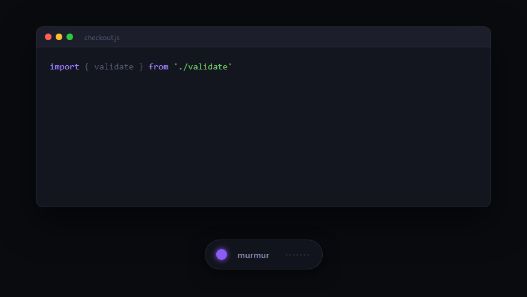

# Murmur

[](https://github.com/EricSekyere/murmur/actions/workflows/ci.yml)
[](https://github.com/EricSekyere/murmur/releases/latest)
[](LICENSE)

Fast, private, on-device dictation for your desktop. Press a hotkey, speak, and your words appear in whatever app has focus — fully offline.



<sub>Animation of the dictation flow, drawn from the app's own interface styling. Not a screen capture.</sub>

Murmur exists because dictation should not require streaming your voice to a cloud service. Everything — audio capture, voice activity detection, speech-to-text, and even LLM-powered rewrites and meeting summaries — runs locally on your machine. The only network traffic is downloading models (SHA-256 verified) and checking GitHub Releases for updates.

## Features

- **Local-first** — speech recognition runs on your machine. No cloud, no accounts, no telemetry.
- **Fast** — Whisper (CUDA-accelerated on NVIDIA GPUs) or NVIDIA Parakeet (DirectML on Windows) transcribes each phrase as you pause.
- **Live preview** — watch your words appear as you speak, both in the dashboard and as a caption near the pill or active window, before each phrase is final.
- **Types anywhere** — text is delivered to the focused window via keystroke simulation or paste, with fallbacks for terminals and elevated windows.
- **Meeting mode** — record microphone plus system audio (Windows loopback), get a local transcript with optional speaker labels, and generate a summary with an on-device LLM. Nothing leaves your machine.
- **Voice editing commands** — say "new line", "new paragraph", "scratch that", "copy that", "undo", "redo", "press tab", or "press escape" as a whole phrase.
- **Developer mode** — dictate code: tech-term correction, spoken symbols (`fat arrow` → `=>`), filler removal, casing commands (camel, snake, pascal, kebab), spoken file paths, and Conventional Commit messages by voice.
- **Codebase vocabulary** — an optional gitignore-aware indexer extracts identifiers from your projects (tree-sitter AST parsing for Rust, Python, JS, TS, Go, Java) and biases the decoder toward them.
- **Text snippets** — define `trigger = expansion` pairs; say the trigger to type the expansion (emails, sign-offs, boilerplate).
- **Multilingual and translate** — transcribe dozens of languages, or translate your speech straight to English, with a multilingual model.
- **Noise-robust** — Silero VAD plus decoder-confidence gating keep sighs, breaths, and background noise from becoming phantom words.
- **Searchable history** — every delivered phrase is saved locally (capped, clearable, can be disabled), tagged with the app it landed in, and filterable from the dashboard.
- **Per-app profiles** — automatically switch output mode and developer mode based on the focused application.
- **Editor integrations** — a built-in MCP server for Claude and Cursor, an opt-in localhost WebSocket API, and a first-party VS Code extension built on it.
- **Dashboard** — history, usage analytics (streaks, word goals, activity heatmap), diagnostics, and settings, all computed locally.

## Install

Download from [Releases](https://github.com/EricSekyere/murmur/releases/latest):

| Platform | Package | Notes |
|---|---|---|
| Windows 10/11 x64 | `.exe` installer | Signed auto-updates. Requires an AVX2-capable CPU (any Intel/AMD from ~2013 onward). NVIDIA GPU optional. |
| Linux x64 (X11) | `.deb` or `.AppImage` | AppImage carries signed auto-updates. |
| macOS (universal) | `.dmg` | Apple Silicon + Intel. Currently unsigned: right-click → Open on first launch. |

The default model (~490 MB) downloads on first launch; downloads resume if interrupted.

## Quick start

| Action | How |
|---|---|
| Start/stop dictation | Double-tap **right Ctrl**, press `Ctrl+Q`, or click the floating pill |
| Record a meeting | Home view → Start Meeting (mic + system audio where supported) |
| Choose a model | Settings → STT Model (smaller = faster, larger = more accurate) |
| Live preview | Settings → Live Preview (interim text as you speak; off for lowest latency) |
| Language / translate | Settings → Speech Language and Translate to English (needs the multilingual model) |
| Text snippets | Settings → Text Snippets (`trigger = expansion`, one per line) |
| App profiles | Settings → App Profiles (`app = options`, e.g. `code = dev`) |
| Codebase vocabulary | Settings → Codebase Vocabulary (add project roots to index) |
| Find the pill | Home view → Find pill (flashes the widget and pulls it back on-screen) |
| Phrase splitting | Settings → Phrase Pause (silence duration that ends a phrase) |
| Filtering | Settings → Transcription Profile (Relaxed / Strict) |

Each phrase is transcribed when you pause and typed into the active window; stopping flushes the final phrase.

## Editor integration

**MCP server.** Let Claude and Cursor work with your dictation through Murmur's built-in Model Context Protocol server: `get_recent_transcripts`, `search_transcripts`, `wait_for_next_dictation`, and `request_dictation` (which asks the running app to start voice capture). Everything stays local — the editor spawns Murmur and talks to it over stdin/stdout, no network.

- **Desktop app:** Settings → Connect to Cursor / Claude → Connect editors, then restart the editor.
- **CLI:**

```sh
murmur mcp install                    # configure every detected client (Cursor, Claude Desktop)
murmur mcp install --client cursor    # just one
claude mcp add murmur -- murmur mcp   # Claude Code
```

**Local WebSocket API.** For precise editor plugins (no synthetic keystrokes), Murmur can expose an opt-in, localhost-only, token-authenticated WebSocket API that streams live dictation events. Off by default; see [docs/local-api.md](docs/local-api.md). A reference VS Code extension lives in [`editors/vscode/`](editors/vscode/).

## Building from source

Prerequisites: Rust 1.93+, CMake, LLVM/libclang (`LIBCLANG_PATH` on Windows), `cargo install tauri-cli --version '^2'`. Optional: CUDA Toolkit 12.x (auto-detected, enables GPU Whisper), NSIS (Windows installer bundling). See [CONTRIBUTING.md](CONTRIBUTING.md) for the full setup, including Linux system packages.

```sh
./build.sh
```

`build.sh` handles the non-obvious parts — forcing optimized MSVC flags for whisper.cpp and wiring up CUDA — see its comments for details.

```sh
cargo check --workspace                   # default features
cargo test -p murmur-core -p murmur-app   # unit tests (~550)
cargo run -p murmur-app                   # desktop app (debug)
```

## Architecture

Cargo workspace, four crates:

- `murmur-core` — the shared library: audio capture (CPAL), Silero VAD (ONNX Runtime), STT engines (whisper.cpp, Parakeet), meeting recording and diarization, local LLM (llama.cpp), output strategies, codebase indexer, config.
- `murmur-app` — Tauri v2 desktop app: tray, dashboard, floating pill, meeting worker, local WebSocket API, session orchestration.
- `murmur-cli` — command-line transcription (`murmur listen`, `murmur models`, `murmur index`, `murmur mcp`).
- `murmur-mcp` — the stdio MCP server and client-registration logic, shared by the CLI and desktop app.

Audio flows: the CPAL capture callback feeds a lock-free channel → VAD segments speech into phrases → a dedicated STT worker thread runs inference → post-processing (voice commands, vocabulary correction, snippets) → an output strategy types or pastes the result into the focused window. The realtime audio callback never blocks, and CPU-heavy inference stays off the async reactor.

CI runs formatting, clippy (warnings denied), the full test suite on Windows and Linux, `cargo audit`, and a license/ban gate on every push and PR ([ci.yml](.github/workflows/ci.yml)).

## Privacy

Everything runs locally. The only network access is the checksum-verified download of model and runtime files, plus update checks against GitHub Releases. Audio and transcripts never leave your machine; dictation audio is never written to disk, and meeting audio is only spooled temporarily for speaker labeling and deleted after processing. See the full [Privacy Policy](PRIVACY.md).

## Contributing

See [CONTRIBUTING.md](CONTRIBUTING.md) for setup, feature flags, and conventions, and [SECURITY.md](SECURITY.md) for reporting vulnerabilities.

## License & terms

[MIT](LICENSE). Use of the app is also covered by the [Terms of Use](TERMS.md).
